# ios-health-tracker
CSC471-Health Tracker project

This is a project assignment for Mobile Application Development for iOS 

**Application Description**

This application would serve users who are health and fitness conscious by allowing them to track their meals, water intake, and exercise duration and intensity. To fit the time constraint for this project the application is developed to only track one day of meals, water intake and exercise.
Please note that the application’s Auto Layout is working only on iPhone 11 with no auto-layout warnings. However, the application itself runs properly with no errors.
The application’s basis for navigation is Navigation Controller with five screens such as: Home, Track, Progress, Feelings and Tips. All of the views have UIView for design at the top of each screen with an addition of Quartz 2D drawing API. Every page has a navbar, mainly to display the page title, however the UITableViewControllers we used for tracking activity have back button functionality. 

**Application screens and detail explanation**

* Screen 1: Home/Profile  

This is the home or profile screen which is initial screen of the application. At first, the user can see static user image and green settings button that will take them to Edit Your Profile screen. Right below the image and settings button there is current date displayed and the rest of the user information such as name, gender, age, height, weight, BMI (Body Mass Index), and goal weight. The BMI result will be displayed based on the calculation from Edit Your Profile screen which is using data from height and weight input. The rest of the information is passed from the Edit Your Profile as the user makes and saves changes. 

* Screen 2: Edit Your Profile

The purpose of this view is to help user edit his profile. First element a user can see is the navbar with the page title, UIView that contains BMI result and also which BMI category the user falls into (underweight, normal, overweight or obese). This BMI calculation is available when a user inputs his height and weight and taps “Calculate BMI” button. Based on the result of the calculation the user will see a message of the weight category for that result. Additionally, user can edit his name through a text field, select gender using UISegmentedControl, edit his height and weight, edit his age using UIPickerView, also add or edit his goal weight. Besides that, there are two buttons in the toolbar. Back to home button will display a sheet alert where a user can choose to stay on edit page or leave and go back to home page. Save button will immediately edit the info user has entered and move back to the home page. 

    

* Screen 3: Track 

Track view serves users to choose their meals, water intake and exercise. This view is made with UITableViewController with dynamic table cells. Each cell has an image and a title that a user can click on. Once the user clicks on one of the tables cells the table view controller will take them to new pages discussed below. 

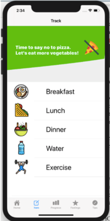

* Screen 4: Breakfast

Breakfast view allows user to enter calories of food he ate for breakfast as well as quantity by clicking plus icon on the top right and UIAlert pops up to enter detail. Another additional functionality is swiping the cell for options such as delete and edit. When selecting edit UIAlert opens up in which user can modify the meal details (same as add)

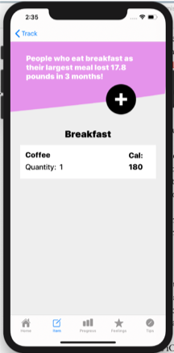 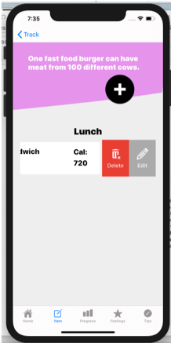 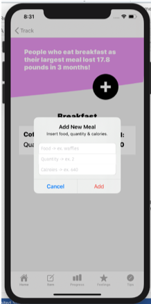 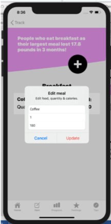 

* Screen 5: Lunch; Screen 6: Dinner

Lunch screen and dinner screen help users enter their calories of what they had for lunch and dinner. Breakfast, lunch, dinner screens are based on the same MealViewController but the difference is display different data. The features of these two are same as Breakfast. A user is able to add by clicking plus icon, to delete by swiping and click delete and, to edit by swiping and click edit. 

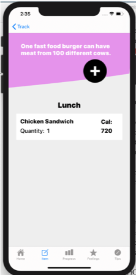 

* Screen 7: Water

Water screen allows user to track how many glasses of water he/she has drank so far in a day. To fill up a glass, user performs a double tap (single tap won’t do anything in this case) and the color of glass will change. To empty a glass, user would perform the same way (double tap) and color of glass will change back to black and white color.

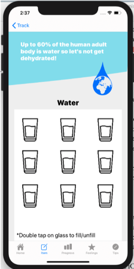 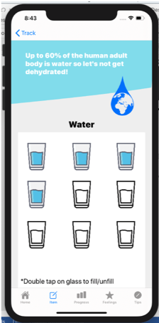

* Screen 8: Exercise

Exercise screen has the same features as MealViewController (breakfast, lunch, dinner). The only difference is that when a user swipes and selects edit or clicks plus icon, the new page will show up (discuss below).

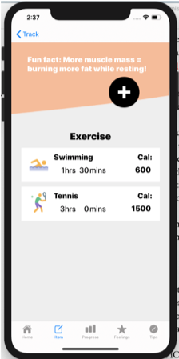

* Screen 9: Add Exercise

The add/new screen for exercise pops up after user selects add or edit. If user selects edit, exercise detail would pass in here and it will push back after update. Adding will add a new exercise instead of updating. In here, a user allows to type of select exercise from the UIPickerView. User needs to enter number of hours and minutes of exercise in order to calculate calories burned. However, a user is able to manually put calories.  Intensity segment is only for calculation purpose. It helps app to calculate more accurate calories burned. The calculation is based on weight, duration and intensity. 

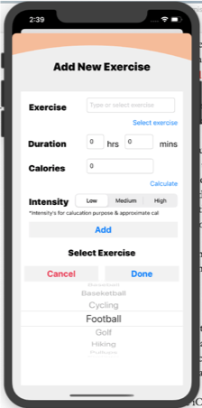

* Screen 10: Progress

The progress page serves as a summary of all the user’s inputs for the day. First, a user can see the navbar with title and UIView with two labels and a button that is replaced with an image of a graph. The graph image is clickable and it will take a user to a GraphViewController or graph view. The graph is not displayed at the moment due to the time constraint of this project. What we planned to do was to use beautiful graphs library which we would install through CocoaPods and display a pie chart or a bar chart of the data represented on the progress page. Below the UIView in progress view, a user can see a summary of activities and quantities of each meal, water and exercise. 

* Screen 11: Feelings

The purpose of this view is to allow users to express their emotions towards their fitness and health progress. The first this a user can see is the navbar with the page title and the UIView with text and image followed by a label with a message for user. In the middle of the screen user can select different emoji icons to express how they feel that day. Once image is selected the label below all of the emojis will change to reflect the feeling. Once emoji is selected, user can drag emoji to the bounding black box below the feelings label and drop it off. Very straightforward and interactive for a user with feelings such as awesome, funky, fine, etc. 

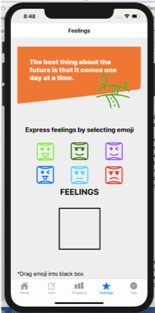 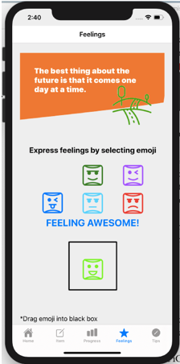

* Screen 12: Tips

The tips view offers some of the tips a user can follow to achieve best physical performance and health. The first this a user can see is the navbar with the page title and UIView with a label and an image. The tips are displayed from one to ten and arranged one below another. 

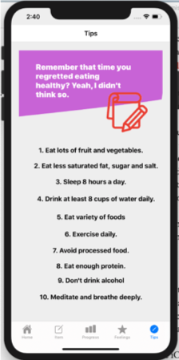

