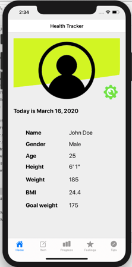
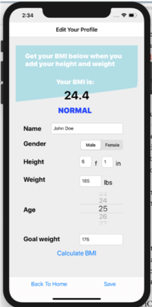
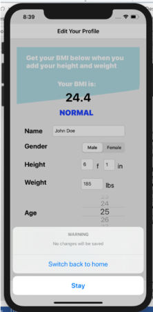

# ios-health-tracker
CSC471-Health Tracker project

This is a project assignment for Mobile Application Development for iOS 

**Application Description**

This application would serve users who are health and fitness conscious by allowing them to track their meals, water intake, and exercise duration and intensity. To fit the time constraint for this project the application is developed to only track one day of meals, water intake and exercise.
Please note that the application’s Auto Layout is working only on iPhone 11 with no auto-layout warnings. However, the application itself runs properly with no errors.
The application’s basis for navigation is Navigation Controller with five screens such as: Home, Track, Progress, Feelings and Tips. All of the views have UIView for design at the top of each screen with an addition of Quartz 2D drawing API. Every page has a navbar, mainly to display the page title, however the UITableViewControllers we used for tracking activity have back button functionality. 

**Application screens and detail explanation**

* Screen 1: Home/Profile  

This is the home or profile screen which is initial screen of the application. At first, the user can see static user image and green settings button that will take them to Edit Your Profile screen. Right below the image and settings button there is current date displayed and the rest of the user information such as name, gender, age, height, weight, BMI (Body Mass Index), and goal weight. The BMI result will be displayed based on the calculation from Edit Your Profile screen which is using data from height and weight input. The rest of the information is passed from the Edit Your Profile as the user makes and saves changes. 

* Screen 2: Edit Your Profile

The purpose of this view is to help user edit his profile. First element a user can see is the navbar with the page title, UIView that contains BMI result and also which BMI category the user falls into (underweight, normal, overweight or obese). This BMI calculation is available when a user inputs his height and weight and taps “Calculate BMI” button. Based on the result of the calculation the user will see a message of the weight category for that result. Additionally, user can edit his name through a text field, select gender using UISegmentedControl, edit his height and weight, edit his age using UIPickerView, also add or edit his goal weight. Besides that, there are two buttons in the toolbar. Back to home button will display a sheet alert where a user can choose to stay on edit page or leave and go back to home page. Save button will immediately edit the info user has entered and move back to the home page. 

    

